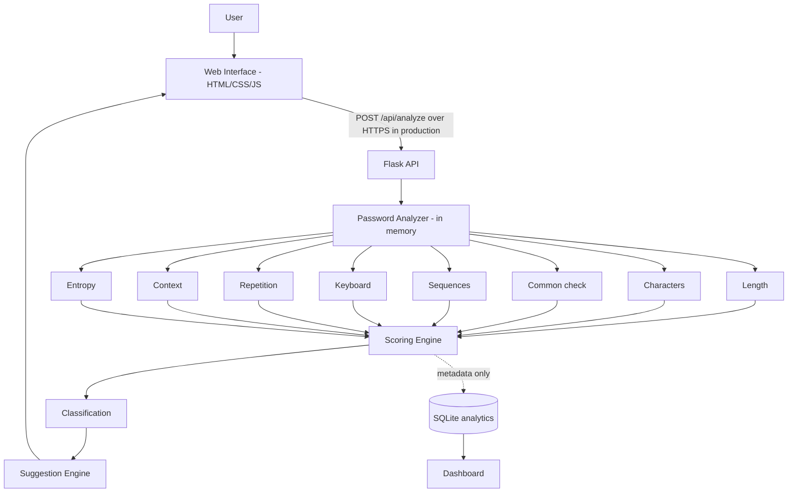

# Password Strength Analyzer & Security Suggestion Tool

> Privacy-focused cybersecurity tool for evaluating password strength using length, predictability, common-password checks, pattern analysis, entropy concepts, and personalized security recommendations.

   

---

## Table of Contents
Overview · Problem · Objectives · Relevance · Features · Architecture · Tech Stack · Analysis · Scoring · Suggestions · Generator · Policy · Privacy · Installation · Usage · API · Testing · Results · Limitations · Future · Screenshots · Learning Outcomes · Disclaimer · Author

---

## Overview
A web application that analyzes a password **locally and in memory** and returns a score (0-100), a classification, specific findings, and actionable suggestions. It deliberately goes beyond "uppercase + lowercase + number + symbol" rules.

> **Core idea:** LENGTH + UNPREDICTABILITY + PATTERN RESISTANCE + COMMON-PASSWORD CHECKS + CONTEXT = better password assessment.

## Problem Statement
- Weak and reused passwords remain a leading cause of account takeover.
- Users overestimate the strength of passwords like `Password123!` because they satisfy composition rules.
- Most meters give a color bar but no explanation of **why** a password is weak.

## Objectives
- Evaluate strength in real time without storing, logging or transmitting the password.
- Detect common passwords, sequences, keyboard walks, repetition, word+number patterns and personal-information overlap.
- Provide specific, non-generic suggestions and a secure generator.
- Show privacy-safe aggregate analytics on a dashboard.
- Teach password hygiene, hashing and MFA concepts.

## Cybersecurity Relevance

| Area | How this project relates |
|---|---|
| Authentication / IAM | Registration and reset flows need strength feedback aligned with NIST SP 800-63B and OWASP ASVS |
| Application security | Secure coding: no secret logging, input validation, generic errors, rate limiting |
| SOC / threat reduction | Fewer guessable passwords reduce credential-stuffing success |
| Security awareness | Explains *why* a password is weak, which changes user behavior |

## Features

| Category | Feature |
|---|---|
| Analysis | Length, character variety, unique-character ratio, entropy-style estimate |
| Detection | Common passwords, ascending/descending sequences, keyboard patterns, repeated characters/substrings, word+number, year patterns, personal info |
| Output | Score 0-100, 5 classes, findings with severity, specific suggestions, score breakdown |
| Policy | Configurable-in-code policy check shown separately from strength |
| Generator | Random password (16/20/24) and passphrase using `secrets` |
| Dashboard | 7 KPI cards, 5 charts, recent-activity table, stored-fields card |
| Education | 10 rules, plaintext vs hash, entropy limits, login-security layers |
| Privacy | No password in DB, logs, API response or URL |

## Architecture



The password never travels into the analytics database. Only score, class, length, ratio and weakness types are stored.

## Technology Stack

| Layer | Choice | Why |
|---|---|---|
| Frontend | HTML, CSS, vanilla JS, Chart.js (CDN) | No build step, beginner friendly |
| Backend | Python 3.10+, Flask | Small, readable, easy to test |
| Analytics | SQLite | Zero setup, enough for aggregate metadata |
| Randomness | `secrets` | Cryptographically secure (unlike `random`) |
| Hashing demo | `hashlib.scrypt` | Standard-library password-hashing function |
| Tests | pytest | Simple unit and privacy tests |

## Password Analysis
`analyze_password(password, context)` returns:
```json
{ "score": 39, "classification": "WEAK", "findings": [], "suggestions": [],
  "metrics": {}, "breakdown": {}, "policy": {} }
```

### Length Analysis
| Length | Label |
|---|---|
| < 8 | Very short |
| 8-11 | Short |
| 12-15 | Better length |
| 16+ | Strong length contribution |

Length alone is not enough: `aaaaaaaaaaaaaaaa` is long but predictable, so repeated runs are collapsed before length is credited.

### Pattern Detection

| Detector | Examples | Function |
|---|---|---|
| Sequences | `1234`, `abcd`, `9876`, `dcba` | `detect_sequences()` |
| Keyboard walks | `qwer`, `asdf`, `zxcv` (forward and reverse) | `detect_keyboard_patterns()` |
| Repetition | `aaaa`, `ababab`, `abcabcabc` | `detect_repetition()` |
| Word + number | `welcome123`, `admin2026`, `Password123!` | `detect_predictable_structure()` |
| Personal info | name, birth year, college/company | `check_context()` |

### Common Password Detection
- Local file `data/common_passwords.txt` (26 educational entries, no leaked personal data).
- Also checks a simple leetspeak-normalized form (`p@ssw0rd`-style).
- Message: *"Your password matches a commonly used password pattern and should not be used."*

### Entropy Estimation
- Formula: `Entropy ≈ L × log2(N)` (L = effective length, N = estimated character pool).
- **Limitation:** assumes random selection. Human passwords are not random, so `Password123!` gets an optimistic number (about 72 bits) despite being predictable.
- Entropy is therefore one signal, combined with pattern and common-password analysis.
- Guess resistance is shown as an **educational estimate only**, never an exact "time to crack".

### Strength Scoring
Project-defined, not a universal standard.

| Component | Max points |
|---|---|
| Length (effective) | 35 |
| Character variety | 15 |
| Unique-character ratio | 10 |
| Pattern resistance | 20 (minus 7 per pattern type) |
| Not a common password | 10 |
| Unpredictability (only if no patterns) | 10 |

| Penalty | Points |
|---|---|
| Common password | -40 |
| Word + number structure | -32 (dictionary word only: -8) |
| Repetition | -12 |
| Keyboard pattern | -10 |
| Sequence | -10 |
| Personal information | -15 |

Passwords under 8 characters are capped at 20, under 10 at 40, and under 12 at 60.

| Score | Classification |
|---|---|
| 0-20 | VERY WEAK |
| 21-40 | WEAK |
| 41-60 | MODERATE |
| 61-80 | STRONG |
| 81-100 | VERY STRONG |

### Security Suggestions
Suggestions are specific and never contain the password, for example:
- "Your password contains a predictable sequence."
- "A common word plus digits or a year is easy to guess."
- "Use a password manager" and "Enable MFA wherever it is available."

### Password Generator
- Lengths 16 / 20 / 24, optional uppercase, lowercase, numbers, symbols; or a 4-6 word passphrase.
- Uses `secrets` and guarantees one character from each selected type.
- Generated values are never stored.

### Password Policy Checker
| Rule | Default |
|---|---|
| Minimum length | 12 |
| Maximum supported length | 128 |
| Common-password check | On |
| Personal-info check | On |
| Spaces | Allowed |
| Forced periodic rotation | Not required |

Shown as **POLICY PASS / POLICY FAIL**, separate from the strength score. `Password123!` passes the policy yet scores WEAK: compliance is not strength.

## Privacy Design

| Rule | How it is enforced |
|---|---|
| Not stored | No password column or hash in the database |
| Not logged | No logging of request bodies; Werkzeug logs set to WARNING; generic error messages |
| Not returned | API response never includes the password (tested) |
| Not in URL | Passwords are sent in a POST body only |
| Not persisted in browser | No `localStorage` / `sessionStorage` calls in the code |
| Not sent elsewhere | Analysis is local; no third-party API calls |
| Hidden by default | `type="password"` with Show/Hide toggle |

## Installation
```bash
git clone <repository-url>
cd Password-Strength-Analyzer
python -m venv venv
venv\Scripts\activate          # macOS/Linux: source venv/bin/activate
pip install -r requirements.txt
```

## Usage
```bash
python backend/app.py
```
Open **http://127.0.0.1:5000**.

| Page | URL | Purpose |
|---|---|---|
| Analyzer | `/` | Live meter, findings, suggestions, policy |
| Dashboard | `/dashboard.html` | KPIs, charts, recent metadata |
| Generator | `/generator.html` | Secure password / passphrase |
| Learn | `/learn.html` | Rules, hashing, entropy, login security |

Optional environment variables (set in your shell; `.env.example` lists them): `FLASK_DEBUG`, `RATE_LIMIT_PER_MIN`.

## API Documentation

| Method | Endpoint | Purpose |
|---|---|---|
| POST | `/api/analyze` | Analyze a password (body: `password`, optional `context`, optional `record`) |
| POST | `/api/generate-password` | Generate a password or passphrase |
| GET | `/api/dashboard/stats` | Aggregate statistics |
| GET | `/api/analytics/weaknesses` | Weakness type counts |
| GET | `/api/analytics/recent` | Last 10 analyses (metadata only) |

| Status | Meaning |
|---|---|
| 200 | Success |
| 400 | Invalid request body |
| 413 | Request or password too large |
| 429 | Rate limit exceeded (120/min per IP by default) |
| 500 | Generic server error (no request content echoed) |

Example:
```bash
curl -X POST http://127.0.0.1:5000/api/analyze -H "Content-Type: application/json" -d "{\"password\":\"Password123!\"}"
```
Full details: [docs/03_Architecture_and_API.md](docs/03_Architecture_and_API.md).

## Testing
```bash
python -m pytest -q
```
- 34 automated tests: analysis, detectors, scoring boundaries, generator, hashing demo, policy, and a privacy test (password absent from response, logs and database file).
- Full test table: [reports/Test_Report.md](reports/Test_Report.md). Full report: [reports/Project_Report.md](reports/Project_Report.md).

## Security Testing
| Check | Method |
|---|---|
| Password not in response / logs / DB | Automated (`test_api_privacy`) |
| No password column | Automated (schema check) |
| No browser storage use | `grep -rn "localStorage\|sessionStorage" frontend` (should return nothing) |
| Password field type | Inspect element: `type="password"` |
| No password in URL | DevTools Network tab: POST body only |

Details: [docs/04_Security_Testing.md](docs/04_Security_Testing.md).

## Results
Scores from the current build (synthetic inputs):

| Input | Score | Class | Why |
|---|---|---|---|
| `123456` | 0 | VERY WEAK | Common, short, sequence |
| `Password123!` | 39 | WEAK | Passes composition and policy, but common word + number |
| `aaaaaaaaaaaaaaaa` | 17 | VERY WEAK | Long but repetitive |
| `qwerty2026!` | 18 | VERY WEAK | Keyboard pattern + year + common word |
| Random 20-char (generated) | ~99 | VERY STRONG | No patterns, high randomness |
| 5-word passphrase (generated) | ~86 | VERY STRONG | Long, no predictable structure |

## Limitations
- Heuristic scoring; no formula can perfectly measure strength.
- Small educational word lists: lowercase combinations of ordinary words (e.g. `zebraplumtrain`) can score higher than a real attacker model would allow.
- No breach-corpus check and no non-English dictionaries.
- Entropy estimate assumes randomness.
- Rate limiting is in-memory, per process.
- Development server only; production needs HTTPS, a production WSGI server and proper rate limiting.
- Analytics are only seeded with synthetic data and are not tied to real users.

## Future Improvements
- Mature estimator library (e.g. zxcvbn-style) and larger licensed wordlists
- Privacy-preserving breach checks (k-anonymity)
- Configurable enterprise policies and admin UI
- Passkeys / WebAuthn and MFA education modules
- Accessibility audit and localization
- Organization-level aggregate reporting without collecting passwords
- Split `password_analyzer.py` into separate detector, scoring and suggestion modules

## Screenshots
Store in `screenshots/` (full checklist in [docs/05_GitHub_and_Screenshots.md](docs/05_GitHub_and_Screenshots.md)). Use synthetic passwords only.

| Screen | File |
|---|---|
| Analyzer, weak result | `screenshots/06_result_weak.png` |
| Analyzer, very strong | `screenshots/09_result_very_strong.png` |
| Dashboard | `screenshots/19_dashboard.png` |
| Generator | `screenshots/17_generator.png` |
| Tests | `screenshots/22_unit_tests.png` |

## Learning Outcomes
- Why composition rules fail and what to measure instead
- Entropy and its limits
- Pattern detection with regex and string logic
- Password hashing, salting, MFA and defense in depth
- Secure coding: no secret logging, generic errors, safe randomness
- Writing tests, documenting and presenting a security project

## Security Disclaimer
This is an educational, defensive project. It contains no cracking, credential-testing or password-collection functionality. Use only synthetic passwords for demos. Do not type real passwords into any tool you do not control and trust. Scores are project-defined estimates, not guarantees.

## Author
**[Your Name]** · [Your College] · [LinkedIn URL] · [GitHub URL]
