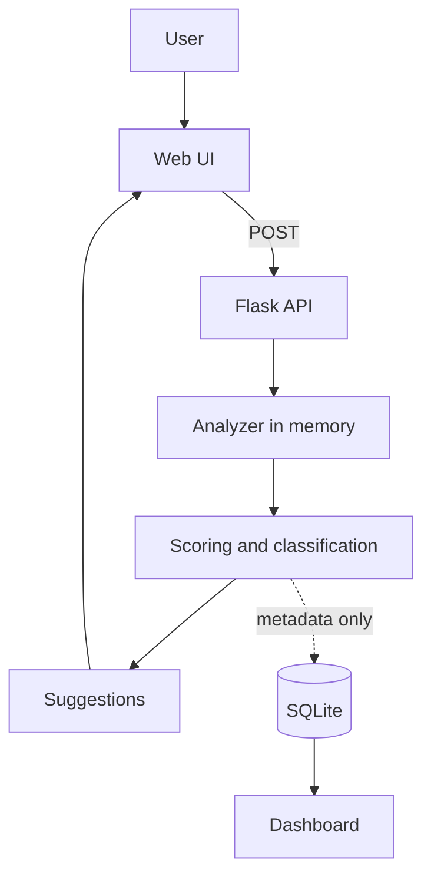

# Project Report
## Password Strength Analyzer & Security Suggestion Tool

| Field | Details |
|---|---|
| Student | [Your Name] |
| Institution | [Your College] |
| Domain | Cybersecurity - Authentication and Application Security |
| Technology | Python, Flask, SQLite, HTML/CSS/JavaScript, Chart.js |
| Date | [Month Year] |

---

## 1. Abstract
Weak and reused passwords remain a major cause of account compromise, and many password meters rely only on character-type rules that users can satisfy with predictable choices such as `Password123!`. This project presents a privacy-focused web tool that evaluates passwords using length, effective character variety, common-password matching, sequence, keyboard-walk and repetition detection, word-plus-number structure, personal-information overlap and an entropy-style estimate. It returns a 0-100 score, a five-level classification, specific findings and recommendations. Passwords are processed in memory only and are never stored, logged or returned. The system also provides a secure generator, a policy checker, a hashing demonstration, a metadata-only analytics dashboard and 34 automated tests, including privacy tests.

## 2. Introduction
- Passwords remain the most common authentication method.
- Users need feedback that explains weaknesses, not only a colored bar.
- A password analyzer is itself sensitive: it receives secrets, so its own design must be secure.

## 3. Problem Statement
| Problem | Effect |
|---|---|
| Composition rules are easy to satisfy predictably | False sense of security |
| Reuse across sites | Credential stuffing succeeds |
| Generic feedback | Users do not know what to fix |
| Tools that log or store inputs | Create new privacy risk |

## 4. Objectives
- Provide real-time, explainable strength analysis.
- Detect common and predictable patterns.
- Offer specific suggestions and a secure generator.
- Protect privacy by design.
- Present safe aggregate analytics and educational content.
- Verify behavior with automated tests.

## 5. Background Study
| Topic | Summary |
|---|---|
| Authentication | Verifying identity through something you know, have or are |
| Password attacks (concepts) | Guessing likely passwords, using breached lists, credential stuffing |
| Entropy | Uncertainty measure; `L x log2(N)` for random selection |
| Hashing and salting | One-way storage with per-user random salt and slow algorithms |
| MFA | Additional factor reduces impact of stolen passwords |
| Standards | NIST SP 800-63B and OWASP ASVS favor length, banned-password checks, no forced rotation |

## 6. Existing Approaches and Gaps
| Approach | Strength | Gap |
|---|---|---|
| Composition rules only | Simple | Accepts `Password123!` |
| Color bar meters | Quick feedback | No explanation |
| Estimator libraries | Pattern-aware | Not tailored to teaching or privacy reporting |
| Online checkers | Convenient | Users may submit real passwords to third parties |

## 7. Proposed System
- Local analyzer service with independent detectors and a transparent scoring model.
- Specific suggestions generated from detected findings.
- Metadata-only analytics, with no password or hash column.
- Four-page interface: Analyzer, Dashboard, Generator, Learn.

## 8. System Architecture

| Component | Responsibility |
|---|---|
| Frontend | Input, live results, charts, education |
| API | Validation, rate limiting, headers, generic errors |
| Analyzer | Detection, scoring, suggestions, policy |
| Generator | Secure random passwords and passphrases |
| Database | Aggregate metadata |

## 9. Password Analysis Methodology
| Step | Description |
|---|---|
| 1. Input handling | Truncate to a safe maximum; process in memory |
| 2. Feature extraction | Length, character types, unique count and ratio |
| 3. Detection | Common, sequence, keyboard, repetition, structure, context |
| 4. Entropy estimate | On effective length (runs collapsed) |
| 5. Scoring | Weighted points minus penalties, then short-length caps |
| 6. Classification | Five bands |
| 7. Suggestions and policy | Findings mapped to advice; separate policy result |

## 10. Feature Extraction
| Feature | Definition |
|---|---|
| Length | Number of characters |
| Character types | Lowercase, uppercase, numbers, symbols, spaces |
| Unique character ratio | Unique characters / length |
| Effective length | Length after collapsing repeated runs |

## 11. Pattern Detection
| Pattern | Rule |
|---|---|
| Sequence | 4+ consecutive characters in ascending or descending order |
| Keyboard walk | 4+ characters along a keyboard row, forward or reverse |
| Repetition | 4+ identical characters, or a 2-4 character block repeated 3+ times |
| Word + number | Common word followed by short number/symbols, with simple leetspeak normalization |
| Year | `19xx` / `20xx` present |
| Personal info | Name, organization (3+ characters) or birth year in the password |

## 12. Common Password Detection
- Local educational list (`data/common_passwords.txt`, 26 entries); case-insensitive; leetspeak-normalized match.
- No leaked personal data is included. Limitation: the list is small.

## 13. Entropy Concepts
- `Entropy ≈ L x log2(N)`, N from character classes present (26/26/10/33 + space).
- Optimistic for human-made passwords, so it is combined with pattern checks.
- Guess resistance is reported as an educational estimate, not a crack time.

## 14. Strength Scoring Model
| Component | Max |
|---|---|
| Effective length | 35 |
| Variety | 15 |
| Unique ratio | 10 |
| Pattern resistance | 20 |
| Not common | 10 |
| Unpredictability | 10 |

| Penalty | Value |
|---|---|
| Common | -40 |
| Word + number | -32 (dictionary word only: -8) |
| Repetition | -12 |
| Keyboard | -10 |
| Sequence | -10 |
| Personal info | -15 |

Caps: under 8 characters, max 20; under 10, max 40; under 12, max 60. Bands: 0-20, 21-40, 41-60, 61-80, 81-100. The model is project-defined and not an industry standard.

## 15. Recommendation Engine
| Finding | Suggestion |
|---|---|
| Short | Use 12+ characters, preferably a passphrase |
| Common | Choose something not on public lists |
| Sequence / keyboard | Remove predictable runs |
| Repetition | Replace repeats with unrelated characters |
| Word + number | Avoid common word and year combinations |
| Personal info | Do not include name, birth year, organization |
| Always | Unique passwords, password manager, MFA |

## 16. Password Generator
- `secrets` (OS CSPRNG); `random` is avoided because it is predictable.
- Password length 16/20/24 with selectable character types; passphrase 4-8 words.
- Output shown once and never stored.

## 17. Password Policy
| Rule | Default |
|---|---|
| Minimum length | 12 |
| Maximum length | 128 |
| Common-password check | On |
| Personal-info check | On |
| Rotation | Not forced |

Policy results are independent from strength: `Password123!` is POLICY PASS but WEAK.

## 18. Secure Password Storage (Education)
- Plaintext and fast hashes are unsafe; use salted, slow hashing (Argon2id, bcrypt, scrypt, PBKDF2).
- `hashing_demo.py` demonstrates salted scrypt with a synthetic password and is not connected to analyzer input.
- The analyzer does not store any password or hash.

## 19. Privacy and Security Design
| Control | Implementation |
|---|---|
| No storage | No password/hash column |
| No logging | No body logging, generic errors |
| No echo | Password never in response |
| No URL | POST body only |
| No browser persistence | No localStorage / sessionStorage use |
| Rate limiting | 120 requests/min/IP (in-memory) |
| Headers | `no-store`, `nosniff`, `no-referrer` |
| Transport | HTTPS required in production |

## 20. Dashboard and Analytics
| Element | Content |
|---|---|
| KPI cards (7) | Total, average score, five class counts |
| Charts (5) | Strength distribution, score distribution, length distribution, weakness types, pattern frequency |
| Recent table | Last 10 analyses, metadata only |
| Stored-fields card | States exactly what is kept |

Initial dashboard data is synthetic (about 260 generated samples analyzed and discarded; only metadata kept).

## 21. Testing
- 34 automated tests (analysis, detectors, boundaries, generator, hashing, policy, privacy).
- Full table: `Test_Report.md`.

## 22. Security Testing
Password absence from response, logs, database and URL; schema without password column; no browser storage. Details in `docs/04_Security_Testing.md`.

## 23. Results

| Input | Score | Class | Policy |
|---|---|---|---|
| `123456` | 0 | VERY WEAK | FAIL |
| `letmein` | 0 | VERY WEAK | FAIL |
| `aaaaaaaaaaaaaaaa` | 17 | VERY WEAK | PASS |
| `qwerty2026!` | 18 | VERY WEAK | FAIL |
| `welcome123` | 29 | WEAK | FAIL |
| `Password123!` | 39 | WEAK | PASS |
| `AAAAAA123!` | 38 | WEAK | FAIL |
| Generated 20-character password | about 99 | VERY STRONG | PASS |
| Generated 5-word passphrase | about 86 | VERY STRONG | PASS |

Key finding: composition-compliant passwords can still be weak, and long passphrases score well without symbols.

## 24. Limitations
- Heuristic scoring; small word lists; no breach corpus.
- Lowercase word combinations (e.g. `zebraplumtrain`, 81) can be over-rated.
- Entropy assumes random choice.
- In-memory rate limiting; development server; no authentication on dashboard endpoints.
- Dashboard uses synthetic seed data.

## 25. Future Scope
| Item | Benefit |
|---|---|
| Stronger estimator and larger wordlists | More realistic scoring |
| k-anonymity breach check | Detect known leaked passwords privately |
| Configurable policies / admin UI | Organization use |
| Passkey and MFA modules | Modern authentication education |
| Modular refactor | Easier maintenance |
| Accessibility and localization | Wider audience |

## 26. Conclusion
The project demonstrates that useful password feedback comes from combining length, unpredictability, pattern resistance and context, and that security tools must protect the data they analyze. It delivers an explainable analyzer, generator, education pages, privacy-safe analytics and automated tests, while being explicit about its heuristic limits.

## References
- NIST SP 800-63B, Digital Identity Guidelines: Authentication and Lifecycle Management
- OWASP Application Security Verification Standard (ASVS)
- OWASP Password Storage Cheat Sheet
- Python documentation: `secrets`, `hashlib.scrypt`
